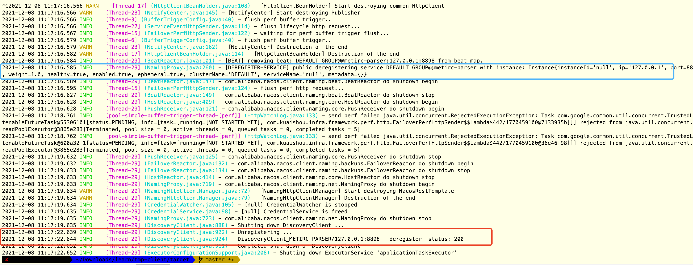

# 多注册中心框架
###目的
从eureka注册中心平滑迁移，从而解决eureka上下线痛点

###功能
1. 集成eureka与nacos client
2. 注册: 支持同时向多个注册中心注册本机
3. 获取实例列表: 支持实时切换注册中心进行获取

###目录结构
```text
.
├── MultiDiscoveryManager.java 多个注册中心client注册、销毁、实例列表获取封装
├── discovry
│   ├── DiscoveryWrapper.java client抽象interface
│   ├── MultiDiscoveryAutoConfiguration.java client自启动配置
│   ├── config
│   │   └── EurekaInstanceConfig.java eureka-client启动配置类
│   ├── impl
│   │   ├── EurekaDiscovery.java eureka-client对DiscoveryWrapper的实现
│   │   └── NacosDiscovery.java nacos-client对DiscoveryWrapper的实现
│   └── properties
│       └── MetaDataProperties.java 启动通用信息封装
├── model
│   └── InstanceWrapperObj.java 实例信息通用封装
├── ribbon
│   ├── MultiDiscoveryRibbonAutoConfiguration.java ribbon 自启动配置
│   ├── MultiDiscoveryRibbonClientConfiguration.java ribbon-client配置类
│   ├── rule
│   │   └── RealTimeRoundRobinRule.java 自定义的实时切换注册中心的轮询规则
│   └── serverList
│       └── MultiDiscoveryServerList.java ribbon启动时serverList实现
└── util
    ├── HostInfoUtils.java 本机host信息工具类
    └── PropertyUtil.java 配置文件读取属性工具类

```
###核心思想
1. 关注各个注册中心client的注册、订阅、关闭的核心能力，同时各个注册中心client实现时都做了cache所以封装时不需要再封装一层cache
2. 自定义loadBalanceRule，绕过ribbon的cache
3. 利用spring的spi机制，在spring.factories中定义集成的client
###启动对比

11:13:23时应用启动
-------------------------------

nacos的变更几乎实时
-------------------------------

eureka有7秒的延迟
###关闭对比

nacos 11:17:16取消注册本机、eureka 11:17:22取消注册本机
-------------------------------

nacos的变更几乎实时
-------------------------------

eureka有7秒的延迟
-------------------------------
###配合feign使用
```xml
<dependency>
    <groupId>org.springframework.cloud</groupId>
    <artifactId>spring-cloud-starter-openfeign</artifactId>
    <version>2.1.5.RELEASE</version>
</dependency>
<dependency>
    <groupId>org.springframework.cloud</groupId>
    <artifactId>spring-cloud-starter-netflix-ribbon</artifactId>
    <version>2.1.5.RELEASE</version>
</dependency>
<dependency>
    <groupId>com.boom</groupId>
    <artifactId>mutil-discovry-ribbon</artifactId>
    <version>1.0-SNAPSHOT</version>
</dependency>
```
```yaml
server:
  port: 8899

spring:
  application:
    name: metirc-parser
    
discovery:
  multi:
    #开启功能
    enabled: true
  eureka:
    #开启eureka
    enabled: true
    address: http://127.0.0.1:8700/eureka
    #拉取实例列表的优先级,值越大优先级越高
    priority: 1
    #是否注册自身
    register: false
    #eureka刷新cache的延迟(秒)
    refresh-interval: 2
  nacos:
    enabled: true
    address: 127.0.0.1:8848
    priority: 2
    register: false
```
###单纯注册使用
```xml
<dependency>
    <groupId>com.boom</groupId>
    <artifactId>mutil-discovry-ribbon</artifactId>
    <version>1.0-SNAPSHOT</version>
</dependency>
```
```yaml
server:
  port: 8899

spring:
  application:
    name: metirc-parser
    
discovery:
  multi:
    enabled: true
  eureka:
    enabled: true
    address: http://127.0.0.1:8700/eureka
    priority: 1
    #注册自身
    register: true
  nacos:
    enabled: true
    address: 127.0.0.1:8848
    priority: 2
    register: true
```
###测试代码
```java
import java.util.Collections;
import java.util.List;
import java.util.stream.Collectors;

import javax.annotation.Resource;

import org.springframework.web.bind.annotation.GetMapping;
import org.springframework.web.bind.annotation.RestController;


import com.alibaba.nacos.api.exception.NacosException;
import com.alibaba.nacos.api.naming.NamingService;
import com.boom.MultiDiscoveryManager;
import com.netflix.discovery.EurekaClient;
import com.self.feign.FileFeign;

import feign.Param;

@RestController
public class TestController {

    @Resource
    private FileFeign fileFeign;
    @Resource
    private MultiDiscoveryManager multiDiscoveryManager;

    @GetMapping(path = "/test")
    public String test() {
        return fileFeign.test();
    }

    /**
     * 获取实例列表
     * @param name 注册的应用名称
     */
    @GetMapping(path = "/test2")
    public List<String> test2(String name) {
        Object client = multiDiscoveryManager.getClient(name);
        if (client instanceof EurekaClient) {
            return ((EurekaClient) client).getApplication("metirc-parser").getInstances()
                    .stream().map(item -> item.getIPAddr() + ":" + item.getPort())
                    .collect(Collectors.toList());
        } else {
            try {
                return ((NamingService) client).selectInstances("metirc-parser", true)
                        .stream().map(item -> item.getIp() + ":" + item.getPort())
                        .collect(Collectors.toList());
            } catch (NacosException e) {
                e.printStackTrace();
            }
        }
        return Collections.emptyList();
    }

    /**
     * 切换获取实例列表的注册中心
     * @param p nacos/eureka
     */
    @GetMapping("/change")
    public String change(@Param("p") String p) {
        MultiDiscoveryManager.setEnforceClientKey(p);
        return "ok";
    }
}
```
###测试脚本
```shell
#!/bin/bash
while true
do
 echo -e "\n$(date "+%Y-%m-%d %H:%M:%S")\nnacos"
 curl 'http://127.0.0.1:7788/test2?name=nacos'
 echo -e '\neureka:'
 curl 'http://127.0.0.1:7788/test2?name=eureka'
 sleep 1
done
```
